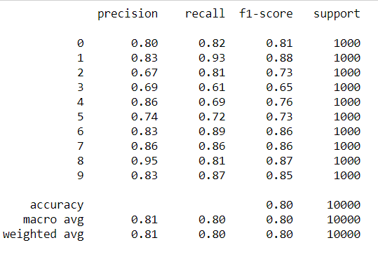

# CIFAR -10 Dataset Classification using ResNet102V2 

Accuracy achieved is 80.1%.
Adam Optimizer was used with a learning rate of 0.0005 and model was trained for 24 epochs and stopped using early stopping callback.

## CLASSIFICATION REPORT:

## TRAINING PLOTS:

            

## CONFUSION MATRIX :

The model was trained on Tensorflow 2.1.0.
The trained model can be downloaded from [here](https://www.google.com).
